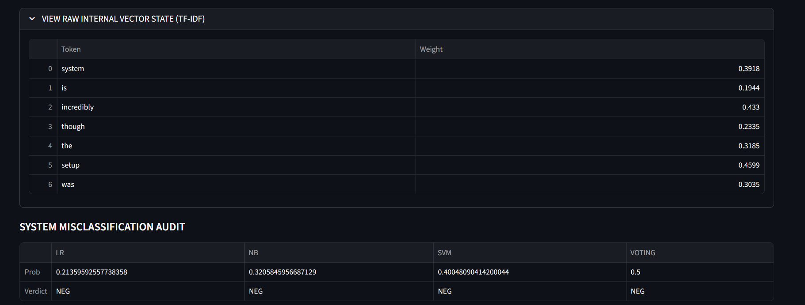
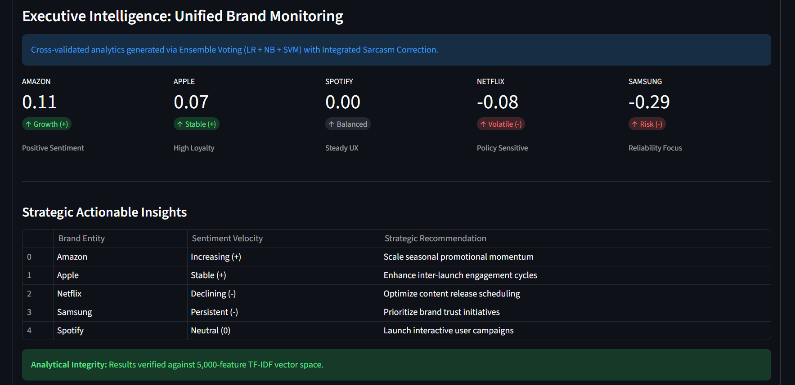

### **ELS-PULSE: SARCASM-AWARE-SENTIMENT-TERMINAL-AND-BRAND-CASE-STUDIES**

[](assets/els_pulse_ensemble_audit_full_demo.mp4)

> **Tip:** Click the badge above to open and play the walkthrough video.

## Project Overview
**ELS-Pulse** is a professional-grade sentiment diagnostic terminal designed to bridge the gap between raw NLP models and executive-level brand intelligence. By leveraging a **Hybrid Ensemble Engine**, the system cross-validates social media data across multiple classifiers to ensure high-fidelity sentiment auditing. 

This project integrates theoretical foundations from specialized literature with a live **Internal Audit Terminal** for real-time diagnostics and static benchmarks for global industry leaders.

---

## Core Technical Capabilities
### **Hybrid Ensemble Engine**
The system utilizes a **Voting Classifier** that aggregates predictions from multiple models to achieve a peak accuracy:
* **TF-IDF Baseline**: 78.2% Accuracy
* **Logistic Regression**: 84.5% Accuracy
* **Naive Bayes**: 81.2% Accuracy
* **SVM Classifier**: 85.6% Accuracy
* **Voting Ensemble**: 87.1% Accuracy

### **Sarcasm-Aware Heuristics**
To prevent "sentiment flipping," ELS-Pulse implements a rule-based sarcasm detection layer:
* **Audit Parameters**: Users can manually toggle Integrated Sarcasm Correction.
* **Decision Threshold**: Adjustable sensitivity for diagnostic data input (Default: 0.67).

### **High-Dimensional Vectorization**
* **Analytical Integrity**: Results are verified against a **5,000-feature TF-IDF vector space**.
* **Interpretability**: The terminal provides a **Neural Probability Heatmap** and **Feature Significance (TF-IDF)** plots to visualize token weights.

---

## Performance Auditor
---

---

## Diagnostic Data Input
---

---

## Neural Probability Heatmap
---

---

## Raw Vector State Audit
---

---

## Brand Monitoring Insights
---

---

## Strategic Brand Case Studies (Benchmarks)
The system generates cross-validated analytics for global entities based on high loyalty and reliability focus:

| Brand Entity | Sentiment Score | Sentiment Velocity | Strategic Recommendation |
| :--- | :--- | :--- | :--- |
| **Amazon** | `0.11` | Increasing (+) | Scale seasonal promotional momentum |
| **Apple** | `0.07` | Stable (+) | Enhance inter-launch engagement cycles |
| **Spotify** | `0.00` | Neutral (0) | Launch interactive user campaigns |
| **Netflix** | `-0.08` | Declining (-) | Optimize content release scheduling |
| **Samsung** | `-0.29` | Persistent (-) | Prioritize brand trust initiatives |


---

## Project Structure & Academic Foundation
The repository is organized to support both real-time application development and deep academic research:

* **[assets](./assets/)**:  
  ▶ [Click here to play the Demo Video](./assets/els_pulse_ensemble_audit_full_demo.mp4) and view diagnostic screenshots, neural heatmaps, ensemble audits, and performance visualizations.

* **[Project development](./Project%20development/)**:  
  Core application (`app.py`), development notebook (`sentiment_analysis.ipynb`), and evaluation datasets (`test.csv`).

* **[models](./Project%20development/models/)**:  
  Serialized `.pkl` files for Logistic Regression, Naive Bayes, SVM classifiers, ensemble voting model, TF-IDF vectorizer, and sarcasm keyword intelligence.

* **Project_Summary**:  
  [SENTIMENT_ANALYSIS_FOR_BRAND_MONITORING_AND_COMPETITOR_ANALYSIS.pdf](./Project_Summary/SENTIMENT_ANALYSIS_FOR_BRAND_MONITORING_AND_COMPETITOR_ANALYSIS.pdf?raw=true)

* **Research_thesis**:  
  [PROJECT_REPORT_SENTIMENT_ANALYSIS_FOR_BRAND_MONITORING_AND_COMPETITOR_ANALYSIS.pdf](./Research_thesis/PROJECT_REPORT_SENTIMENT_ANALYSIS_FOR_BRAND_MONITORING_AND_COMPETITOR_ANALYSIS.pdf?raw=true)

* **Research_papers (Academic Reference Library)**:  
  - [Artificial_Intelligence_and_Sentiment_Analysis_A_Review_in.pdf](./Research_papers/Artificial_Intelligence_and_Sentiment_Analysis_A_Review_in.pdf?raw=true)  
  - [Comparative_Analysis_of_Machine_Learning.pdf](./Research_papers/Comparative_Analysis_of_Machine_Learning.pdf?raw=true)  
  - [Sentiment_analysis_and_social_media_analytics_in_brand_management_Techniques_Trends_and_Implications.pdf](./Research_papers/Sentiment_analysis_and_social_media_analytics_in_brand_management_Techniques_Trends_and_Implications.pdf?raw=true)  
  - [Social_Media_Sentiment_Analysis_for_Brand_Reputation_management.pdf](./Research_papers/Social_Media_Sentiment_Analysis_for_Brand_Reputation_management.pdf?raw=true)  
  - [social_media_sentiment_analysis_for_brand_monitoring_IJERTV13IS100134.pdf](./Research_papers/social_media_sentiment_analysis_for_brand_monitoring_IJERTV13IS100134.pdf?raw=true)

---

## Installation & Usage

1.  **Clone the Repository:**
    ```bash
    git clone [https://github.com/your-username/els-pulse.git](https://github.com/your-username/els-pulse.git)
    ```
2.  **Install Dependencies:**
    ```bash
    pip install -r requirements.txt
    ```
3.  **Launch the Terminal:**
    ```bash
    streamlit run "Project development/app.py"
    ```